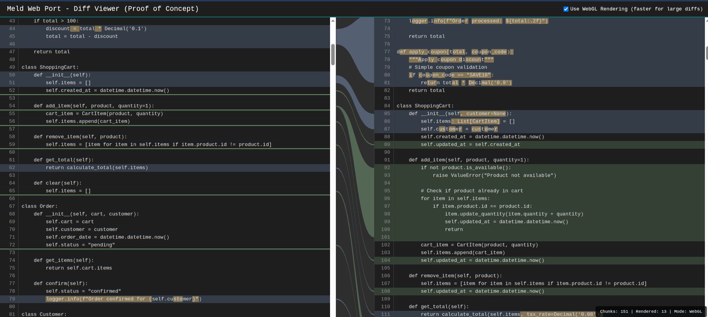

# Meld Web Port - Proof of Concept

A web-based visual diff viewer inspired by [Meld](https://meldmerge.org/), the popular Linux/GTK diff tool. This proof of concept recreates Meld's signature 3-column interface with animated connection curves between changes.



## Quick Start

```bash
# 1. Place two text files to compare
cp file1.txt a.txt
cp file2.txt b.txt

# 2. Generate the diff viewer
python3 meld-port.py

# 3. Open test-output.html in your browser
```

## What It Does

This project generates an interactive HTML diff viewer that displays two files side-by-side with visual connections between changes:

- **Side-by-side comparison** with line numbers and syntax highlighting
- **Visual change markers** showing insertions, deletions, and replacements
- **Animated connection curves** between related changes (like Meld's linkmap)
- **Character-level diff highlighting** within modified lines
- **WebGL rendering** for smooth performance with large diffs
- **Interactive hover effects** to highlight related changes across both files

## Features

- 3-column layout: left file, linkmap, right file
- Color-coded change types:
  - 🟢 Green: Insertions
  - 🔴 Red: Deletions
  - 🔵 Blue: Replacements/Modifications
- Synchronized scrolling with visible connection curves
- Hover over connections to highlight corresponding lines
- Toggle between WebGL (fast) and SVG (fallback) rendering
- Inline character-level diffs for precise change visualization

## Inspiration

This project is inspired by **Meld**, an excellent visual diff and merge tool for Linux. Meld's clean interface and visual linkmap make understanding code changes intuitive. This web port aims to bring that experience to the browser using modern web technologies (HTML5 Canvas, WebGL, JavaScript).

Key inspirations from Meld:
- The iconic 3-column layout with Bézier curve connections
- Color scheme for different change types
- Character-level diff highlighting
- Insert/delete markers for single-line changes

## How It Works

The script computes the diff using Python's `difflib` and generates a standalone HTML file with embedded CSS and JavaScript. Simply provide two text files named `a.txt` and `b.txt`, run the script, and open the generated HTML file in any modern browser.

The connection curves are rendered using **WebGL** for optimal performance with large files, with an automatic fallback to **SVG** for browsers without WebGL support. You can toggle between rendering modes in the UI.

## Technical Details

- **Backend**: Python with `difflib` for diff computation
- **Frontend**: Vanilla JavaScript with WebGL and SVG rendering
- **Template**: Jinja2 for HTML generation
- **Performance**: WebGL shader-based rendering for large files
- **Compatibility**: Modern browsers with WebGL support

## Limitations

- Binary files are not supported
- Lines longer than 8KB are rejected for performance
- Character-level diff is disabled for lines exceeding 20KB combined length
- No merge/edit functionality (view-only)

## License

See [LICENSE](LICENSE) file for details.
